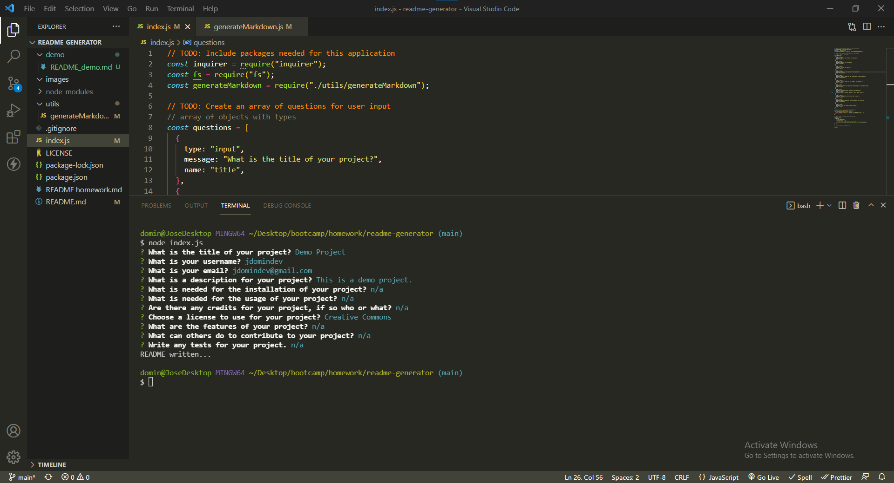
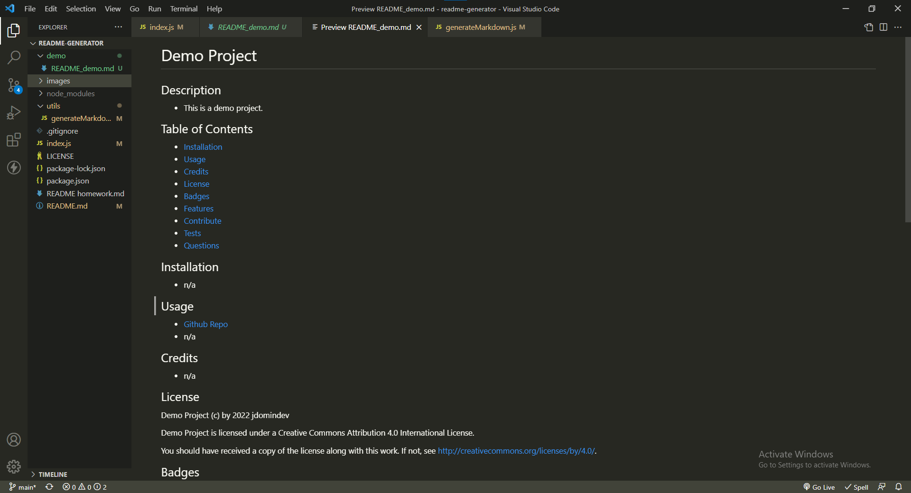
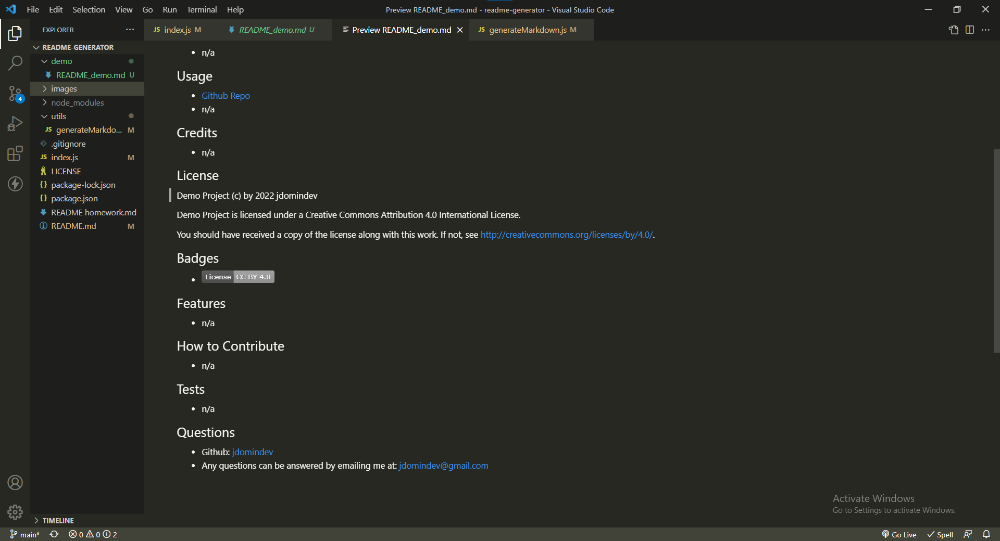

# README-Generator
## Description
- This project is a README generator.
- Its function is to take in a user's answers to prompts, and then use those answers to dynamically create a markdown page for a readme.
- While making this project I learned how to use node.js modules, like inquirer and file system, to take in user inputs in the terminal and then use that data in functions that I created.
- The inquirer module was used to prompt the user and collect the answers, while the fs module was used to write to file the template literals, that held the answers, along with additional markdown language.
## Table of Contents
- [Installation](#installation)
- [Usage](#usage)
- [Credits](#credits)
- [License](#license)
- [Badges](#badges)
## Installation
- You will need to install the inquirer node module and include the fs node module.
## Usage
- Github Repo: https://github.com/jdomindev/readme-generator
- Screenshots:
    
    
    
- Video:
    
## Credits
- N/A
## License
MIT License

Copyright (c) 2022 Jose Dominguez

Permission is hereby granted, free of charge, to any person obtaining a copy of this software and associated documentation files (the "Software"), to deal in the Software without restriction, including without limitation the rights to use, copy, modify, merge, publish, distribute, sublicense, and/or sell copies of the Software, and to permit persons to whom the Software is furnished to do so, subject to the following conditions:

The above copyright notice and this permission notice shall be included in all copies or substantial portions of the Software.

THE SOFTWARE IS PROVIDED "AS IS", WITHOUT WARRANTY OF ANY KIND, EXPRESS OR IMPLIED, INCLUDING BUT NOT LIMITED TO THE WARRANTIES OF MERCHANTABILITY, FITNESS FOR A PARTICULAR PURPOSE AND NONINFRINGEMENT. IN NO EVENT SHALL THE AUTHORS OR COPYRIGHT HOLDERS BE LIABLE FOR ANY CLAIM, DAMAGES OR OTHER LIABILITY, WHETHER IN AN ACTION OF CONTRACT, TORT OR OTHERWISE, ARISING FROM, OUT OF OR IN CONNECTION WITH THE SOFTWARE OR THE USE OR OTHER DEALINGS IN THE SOFTWARE. e-MIT-lightgrey.svg)](https://opensource.org/licenses/MIT)
## Badges

